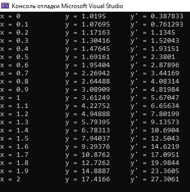

# Лабораторная работа № 7. Решение дифференциального уравнения.

Выполнил студент группы 429  
Гурин Илья Валерьевич

## Вариант № 19
Решить методом Тейлора 3-го порядка задачу Коши

с заданной относительной точностью 0,01.
Требуется построение графиков решения y(x),y'(x), а также фазовых траекторий.

## Теоретическая часть
Кратко (но достаточно для понимания) описать методы, которые используются в программе. Активно использовать формулы.
Задачу Коши будем решать методом Тейлора, и поэтому будем использовать данные формулы:

h-шаг, Xn+1-рассматривамая точка, в которой мы хотим найти y и y', Xn-предыдущая точка, в которой y и y' найдены на прошлой итерации. После того, как y и y' будут найдены, мы начинаем новую итерацию и рассматриваем новую точку x, которая на h больше предыдущей x. Чтобы найти значения в новой точке, необходимо знать значения в прошлой и для начала работы этой схемы нужно выбрать начальную x0 и знать значения y,y',y'',y''',y'''' в этой точке. Точка x0 = 0, и значения y(0), y'(0) нам известны из условия. Чтобы найти y'', выражаем y'' из главной функции

и подставляем известные значения. Чтобы найти y''' или y'''', нужно один или два раза соответственно взять производную по x в главной функции и выражаем y''' и y''''. Далее сами выбираем шаг h и подставляем всё в формулы

и всё повторяем. Цикл работает до тех, пока точка x<=2.
## Практическая часть
Описать структуру программы. Что делают функции программы? Какой у программы вывод? Каков порядок компиляции/запуска программы?
Функции:

1)F_y11

Считает y'' по формуле

2)F_y111

Считает y''' по формуле

3)F_y1111

Считает y'''' по формуле

4)teilor

Считает значение в новой точке по формулам

Использование той или иной формулы зависит от входных данных.

5)main

В этой функции идёт запись в файлы точек x и значений y и y'. Файлы нужны для построения графиков y(x), y'(x), y'(y). В функции есть цикл, который использует всё вышеперечисленные функции для того, чтобы найти значения y, y' в следующих точках.
### Результаты
В результате работы программы у функции 

был получено решение в виде графиков методом Тейлера с точностью 0.01. Ниже приведены запись в консоль, графики y(x), y'(x) и фазовые траектории:

